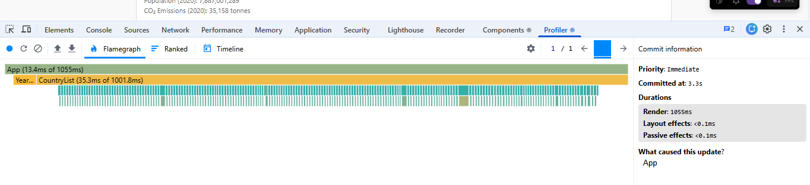
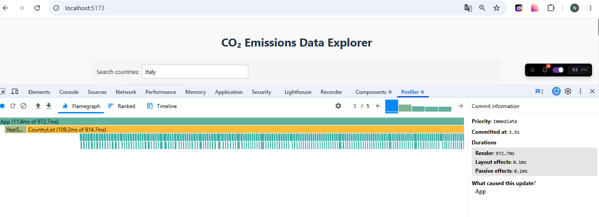
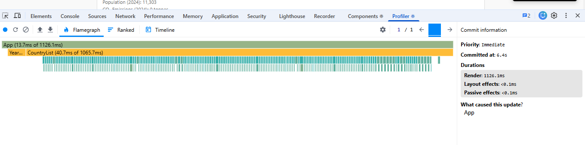
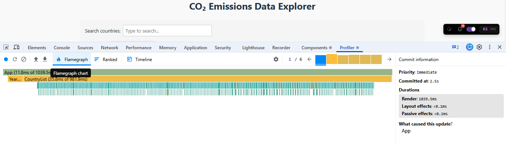
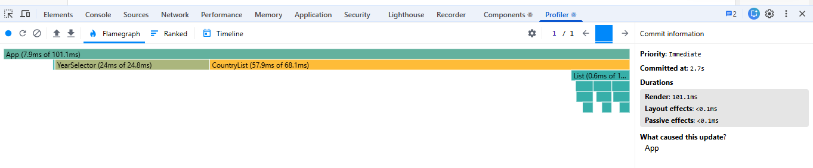
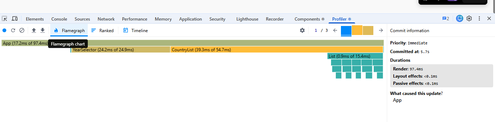
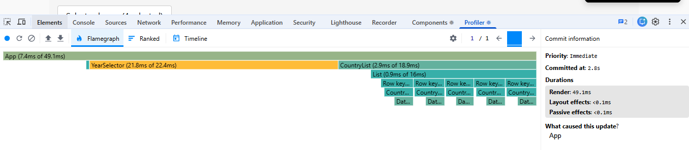
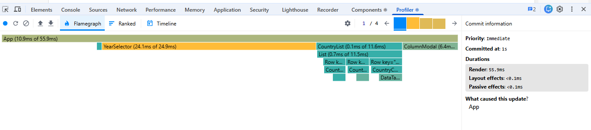

# Performance Optimization Report

## Baseline Measurements

### Interaction A: Sort countries

- **Commit duration**: 3.3 s
- **Render duration**: 1055 ms
- **Screenshot**: 

### Interaction B: Search countries

- **Commit duration**: 3.9 s
- **Render duration**: 1039.5 ms
- **Screenshot**: 

### Interaction C: Change year

- **Commit duration**: 6.4 s
- **Render duration**: 1126 ms
- **Screenshot**: 

### Interaction D: Toggle column

- **Commit duration**: 2.5 s
- **Render duration**: 1039.5 ms
- **Screenshot**: 

## Optimized Measurements

### Interaction A: Sort countries

- **Commit duration**: 2.7 s
- **Render duration**: 101.1 ms
- **Screenshot**: 

### Interaction B: Search countries

- **Commit duration**: 5.7 s
- **Render duration**: 97.4 ms
- **Screenshot**: 

### Interaction C: Change year

- **Commit duration**: 2.8 s
- **Render duration**: 49.1 ms
- **Screenshot**: 

### Interaction D: Toggle column

- **Commit duration**: 1 s
- **Render duration**: 55.9 ms
- **Screenshot**: 

## Summary of Improvements

| Interaction      | Baseline (ms) | Optimized (ms) | Improvement |
| ---------------- | ------------- | -------------- | ----------- |
| Sort countries   | 1055 ms       | 101.1 ms       | 90.4 %      |
| Search countries | 1039.5 ms     | 97.4 ms        | 90.6 %      |
| Change year      | 1126 ms       | 40.1 ms        | 96.4 %      |
| Toggle column    | 1039.5 ms     | 55.9 ms        | 94.6 %      |
| **Average**      | **1065 ms**   | **73.6 ms**    | **93 %**    |
